# ERD — Sistema de Estacionamiento Inteligente

> Relaciones marcadas con `_ref` son **FK lógicas** (cruzan bases de datos, sin constraint real en MySQL).  
> Las líneas sólidas son FK reales dentro de la misma base de datos.

```mermaid
erDiagram

  %% ─── db_auth ───────────────────────────────────────────────────
  ROL {
    bigint id PK
    varchar nombre UK
    varchar descripcion
  }
  USER_CREDENTIAL {
    bigint  id PK
    varchar email UK
    varchar password_hash
    bigint  id_rol FK
    bigint  id_cliente_ref "FK lógica → CLIENTE"
    tinyint activo
  }
  ROL ||--o{ USER_CREDENTIAL : "tiene"

  %% ─── db_seguridad ──────────────────────────────────────────────
  PERMISO {
    bigint  id PK
    varchar nombre
    varchar recurso
    varchar accion
  }
  ROL_PERMISO {
    bigint id PK
    bigint id_rol_ref "FK lógica → ROL"
    bigint id_permiso FK
  }
  PERMISO ||--o{ ROL_PERMISO : "asignado en"

  %% ─── db_usuarios ───────────────────────────────────────────────
  TIPO_CLIENTE {
    bigint  id PK
    varchar nombre UK
    decimal descuento_pct
  }
  CLIENTE {
    bigint   id PK
    varchar  rut UK
    varchar  nombre
    varchar  apellido
    varchar  email UK
    varchar  telefono
    bigint   id_tipo_cliente FK
    datetime fecha_registro
    tinyint  activo
  }
  SUSCRIPCION {
    bigint  id PK
    varchar nombre UK
    text    descripcion
    decimal precio
    decimal descuento_pct
    int     duracion_dias
    tinyint activo
  }
  CLIENTE_SUSCRIPCION {
    bigint  id PK
    bigint  id_cliente FK
    bigint  id_suscripcion FK
    date    fecha_inicio
    date    fecha_fin
    tinyint activo
  }
  TIPO_CLIENTE ||--o{ CLIENTE            : "clasifica"
  CLIENTE      ||--o{ CLIENTE_SUSCRIPCION : "tiene"
  SUSCRIPCION  ||--o{ CLIENTE_SUSCRIPCION : "incluye"

  %% ─── db_vehiculos ──────────────────────────────────────────────
  TIPO_VEHICULO {
    bigint  id PK
    varchar nombre UK
    varchar descripcion
    decimal factor_precio
  }
  VEHICULO {
    bigint  id PK
    varchar patente UK
    varchar marca
    varchar modelo
    varchar color
    int     anio
    bigint  id_tipo_vehiculo FK
    bigint  id_cliente_ref "FK lógica → CLIENTE"
    tinyint activo
  }
  TIPO_VEHICULO ||--o{ VEHICULO : "clasifica"

  %% ─── db_espacios ───────────────────────────────────────────────
  TIPO_ESPACIO {
    bigint  id PK
    varchar nombre UK
    varchar descripcion
    decimal factor_precio
  }
  ESPACIO {
    bigint  id PK
    varchar numero UK
    varchar zona
    int     piso
    bigint  id_tipo_espacio FK
    tinyint disponible
    tinyint activo
  }
  TIPO_ESPACIO ||--o{ ESPACIO : "define"

  %% ─── db_tarifas ────────────────────────────────────────────────
  TARIFA {
    bigint  id PK
    varchar nombre UK
    varchar descripcion
    decimal precio_base_hora
    tinyint activo
  }
  HORARIO_TARIFA {
    bigint  id PK
    bigint  id_tarifa FK
    varchar dia_tipo
    time    hora_inicio
    time    hora_fin
    decimal multiplicador
  }
  TARIFA ||--o{ HORARIO_TARIFA : "tiene"

  %% ─── db_reservas ───────────────────────────────────────────────
  RESERVA {
    bigint   id PK
    bigint   id_cliente_ref "FK lógica → CLIENTE"
    bigint   id_vehiculo_ref "FK lógica → VEHICULO"
    bigint   id_tipo_espacio_ref "FK lógica → TIPO_ESPACIO"
    datetime fecha_inicio
    datetime fecha_fin
    varchar  estado
    datetime fecha_creacion
  }

  %% ─── db_accesos ────────────────────────────────────────────────
  ACCESO {
    bigint   id PK
    bigint   id_vehiculo_ref "FK lógica → VEHICULO"
    bigint   id_espacio_ref "FK lógica → ESPACIO"
    bigint   id_reserva_ref "FK lógica → RESERVA (nullable)"
    varchar  patente_escaneada
    datetime fecha_hora_entrada
    datetime fecha_hora_salida
    varchar  estado
  }

  %% ─── db_pagos ──────────────────────────────────────────────────
  BANCO {
    bigint  id PK
    varchar nombre
    varchar codigo UK
    decimal descuento_pct
    tinyint activo
  }
  TIPO_TARJETA {
    bigint  id PK
    varchar nombre
    varchar red
  }
  METODO_PAGO {
    bigint  id PK
    bigint  id_cliente_ref "FK lógica → CLIENTE"
    bigint  id_tipo_tarjeta FK
    bigint  id_banco FK
    varchar ultimos_4
    varchar nombre_titular
    int     mes_vencimiento
    int     anio_vencimiento
    tinyint predeterminado
    tinyint activo
  }
  COBRO {
    bigint   id PK
    bigint   id_acceso_ref UK "FK lógica → ACCESO (1:1)"
    bigint   id_metodo_pago FK
    bigint   id_tarifa_ref "FK lógica → TARIFA"
    int      minutos
    decimal  monto_base
    decimal  desc_tipo_cliente
    decimal  desc_suscripcion
    decimal  desc_banco
    decimal  monto_final
    varchar  estado
    datetime fecha_cobro
  }
  TIPO_TARJETA ||--o{ METODO_PAGO : "define"
  BANCO        |o--o{ METODO_PAGO : "descuenta"
  METODO_PAGO  ||--o{ COBRO       : "paga"
```

